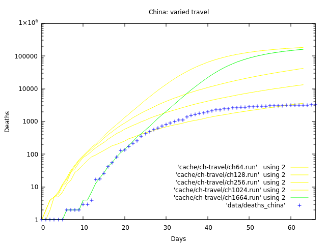
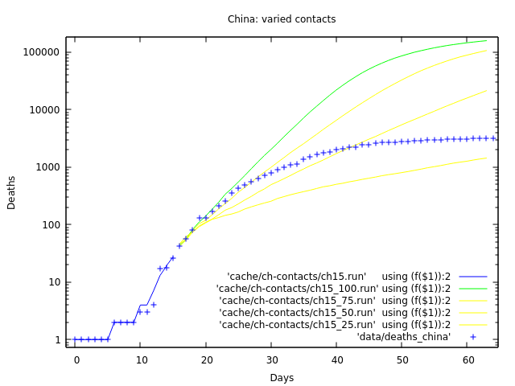

# China

I varied the travel parameter to try to fit China's data better.

```fish
pandemic --recovery=5.59 --lethality=0.0235 \
  --file_deaths=data/deaths_china \
  --alert_deaths=1 --alert_date=2020-01-09 \
  --population=58500000 --contacts=100.0 \
  --travel=1664 \
  --halt_alert_days=63 \
  --transmission=0.381 --seed=c0c3853f10b2eec4dc9a9cc6bd469f73 > cache/sw-travel/ch1664.run
```

What those runs look like:



I varied the contacts parameter to try to fit China's data better.
The lockdown happens 15 days after first death, so I save that run:

```fish
pandemic --recovery=5.59 --lethality=0.0235 \
  --file_deaths=data/deaths_china \
  --alert_deaths=1 --alert_date=2020-01-09 \
  --population=58500000 --contacts=100.0 \
  --travel=1664 \
  --halt_alert_days=15 --description=ch15 \
  --transmission=0.381 --seed=c0c3853f10b2eec4dc9a9cc6bd469f73 --save > cache/ch-contacts/ch25.run
```

Then I run contact variations on top of the ch15 run:A

```fish
pandemic --recovery=5.59 --lethality=0.0235 \
  --file_deaths=data/deaths_china \
  --alert_deaths=1 --alert_date=2020-01-09 \
  --population=58500000 --contacts=100.0 \
  --travel=1664 \
  --halt_alert_days=63 --description=ch15 \
  --transmission=0.381 --seed=c0c3853f10b2eec4dc9a9cc6bd469f73 --load > cache/ch-contacts/ch15_100.run
```

What those runs look like:



The lockdown clearly had the effect of some combination of reduced travel and contacts.
