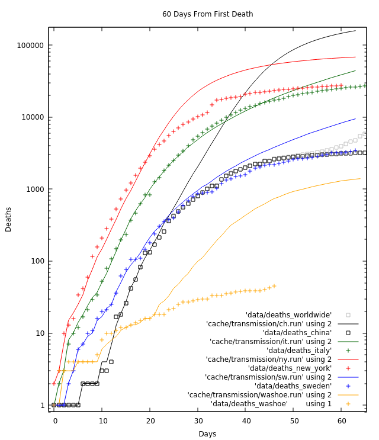

# Pandemic

My Covid-19 Forecaster.
I should mention that I'm not an epidemiologist, but 
I find this problem very interesting.
My model has agents on a square grid that contact eachother 
within a certain distance.

I'm using [TradingView's](https://www.tradingview.com/) COVID-19 charts to try to fit my model.

Because these runs take a long time,
I've decided to only try to fully model(and maintain) Washoe County, Nevada, USA.

## Runs

This is what the runs looks like:



The lines are from my runs below, the symbols are from actual counts.

## Washoe county

Since I live in Washoe county, Nevada(USA), and
the county has the COVID-19 [deaths data](https://gis.washoecounty.us/COVID19) available...
And since I don't have the time to maintain all the things...
I've decided to only spend my time on trying to fully model Washoe county.

The file `data/deaths_washoe` has the observed death counts in Washoe count.
On the first day that the model has at least 1 death(the alert),
I set the date to 2020-03-29.
I set the population to 472,000 for the county population.
Contacts is set to 100%.
The population of the city of Reno is about 251,000
so I set an initial travel estimate of 250, `Math.sqrt(251_000)/2.0`.
Because `pandemic` uses `rand`, setting `seed` allows one to duplicate a run.
The simulation to fit the transmission parameter runs 21 days(3 weeks) after first death.

```fish
# Washoe County, NV, USA
# RSD: 0.124802
# Day: 24 (Mar 29)
pandemic --recovery=5.59 --lethality=0.0235 \
  --file_deaths=data/deaths_washoe \
  --alert_deaths=1 --alert_date=2020-03-29 \
  --population=472000 --contacts=100.0 \
  --travel=250 \
  --halt_alert_days=21 \
  --transmission=0.303 --seed=3d3ced1bc885701491d608c83fb16c95
```

* More [Washoe](WASHOE.md)

### China 

The file `data/deaths_china` has the observed death counts in China.
On the first day that the model has at least 1 death(the alert),
I set the date to Jan 9(2020-01-09).
I set the population to 58.5 Million for the population in Hubei Province.
Contacts is set to 100%(no countermeasures taken).
The population of Wuhan China is about 11.08 million(as of 2018),
so I set an initial travel estimate of 1664, `Math.sqrt(11_080_000)/2.0`.
Because `pandemic` uses `rand`, setting `seed` allows one to duplicate a run.
The simulation to fit the transmission parameter runs 21 days(3 weeks) after first death.

My best first 21 days fit of China:

```fish
# China (Using Hubei Province's population)
# RSD: 0.168111
# Day: 28 (Jan 09)
pandemic --recovery=5.59 --lethality=0.0235 \
  --file_deaths=data/deaths_china \
  --alert_deaths=1 --alert_date=2020-01-09 \
  --population=58500000 --contacts=100.0 \
  --travel=1664 \
  --halt_alert_days=21 \
  --transmission=0.381 --seed=c0c3853f10b2eec4dc9a9cc6bd469f73
```

* More [China](CHINA.md)

### Sweden

The file `data/deaths_sweden` has the observed death counts in Sweden.
On the first day that the model has at least 1 death(the alert),
I set the date to 2020-03-11.
I set the population to 10.1 Million for the country.
Contacts is set to 100%.
I set a travel estimate of 105 based on the population of Stockholm's largest island,
Värmdö (Sqrt[44,397]/2).

My best first 21 days fit of Sweden:

```fish
# Sweden
# RSD: 0.100766
# Day: 16 (Mar 11)
pandemic --recovery=5.59 --lethality=0.0235 \
  --file_deaths=data/deaths_sweden \
  --alert_deaths=1 --alert_date=2020-03-11 \
  --population=10099265 --contacts=100.0 \
  --travel=105 \
  --halt_alert_days=21 \
  --transmission=0.472 --seed=3209f9d7d33c16d43a2041276de7f3e4
```

* More [Sweden](SWEDEN.md)

### Italy

The file `data/deaths_italy` has the observed death counts in Italy.
On the first day that the model has at least 1 death(the alert),
I set the date to 2020-02-21.
I set the population to 60 Million for the country.
Contacts is set to 100%.
I set a travel estimate of 173 based on the population of Bergamo(`Math.sqrt(120287)/2`).

My best first 21 days fit of Italy:

```fish
# Italy
# RSD: 0.093308
# Day: 19 (Feb 21)
pandemic --recovery=5.59 --lethality=0.0235 \
  --file_deaths=data/deaths_italy \
  --alert_deaths=1 --alert_date=2020-02-21 \
  --population=60036000 --contacts=100.0 \
  --travel=173 \
  --halt_alert_days=21 \
  --transmission=0.637 --seed=885e3b526e05e50a2c0146f34808d747
```

### New York

The file `data/deaths_new_york` has the observed death counts in New York State.
On the first day that the model has at least 1 death(the alert),
I set the date to 2020-03-14.
I set the population to 19.45 Million for the state.
Contacts is set to 100%.
I set a travel estimate of 1458 based on the population of New York City(`Math.sqrt(8500000)/2`).

My best first 21 days fit of New York(US).

```fish
# New York
# RSD: 0.253913
# Day: 37 (Mar 14)
pandemic --recovery=5.59 --lethality=0.0235 \
  --file_deaths=data/deaths_new_york \
  --alert_deaths=1 --alert_date=2020-03-14 \
  --population=19450000 --contacts=100.0 \
  --travel=1458 \
  --halt_alert_days=21 \
  --transmission=0.452 --seed=409c3b77a4041f7876284d8c54f86b91
```

## Model

A very important estimate is the Infection Fatality Rate(IFR).
This estimate tries to include unknown people who are infected,
not just confirmed cases.

From [Estimates of the severity of COVID-19 disease](https://www.medrxiv.org/content/10.1101/2020.03.09.20033357v1):

* IFR 0.66% (0.39%, 1.33%),

From [COVID-19 Case-Cluster-Study](https://www.land.nrw/sites/default/files/asset/document/zwischenergebnis_covid19_case_study_gangelt_0.pdf):

* IFR 0.37%

From China's paper published Feb 17:

* CFR 2% (80% mild disease, 14% severe, 5% critical)

I've decided to use an IFR of 0.39% for now...

### IFR 0.39%, 17.8 days to death

```console
$ pandemic --recovery=5.59 --lethality=0.0235 --transmission=0.637 --trials
Emergent properties trials(may take some time)....
## Virus ##
  Fatality Rate:       0.39%
  Infectuous Days:     17.8
  Reproduction Number: 11.35
```

## [Notes](NOTES.md)

## [Timeline](TIMELINE.md)
