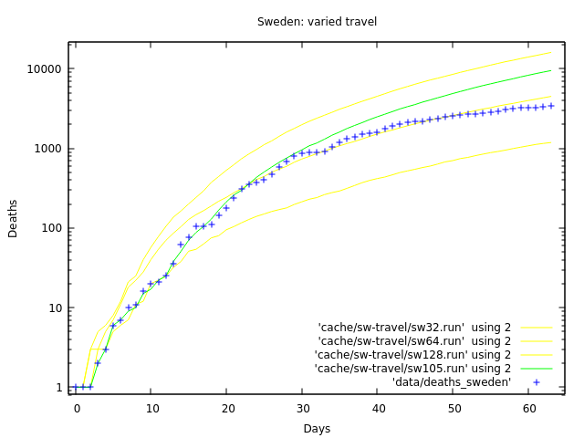

# Sweden

I varied the travel parameter to try to fit Sweden's data better.

```fish
pandemic --recovery=5.59 --lethality=0.0235 \
  --file_deaths=data/deaths_sweden \
  --alert_deaths=1 --alert_date=2020-03-11 \
  --population=10099265 --contacts=100.0 \
  --travel=105 \
  --halt_alert_days=63 \
  --transmission=0.472 --seed=3209f9d7d33c16d43a2041276de7f3e4 > cache/sw-travel/sw105.run
```

What those runs look like:


