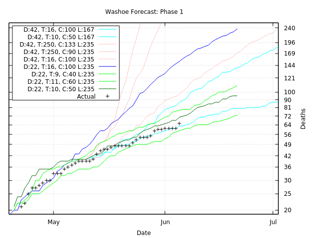

# Washoe county

Mitigations in Washoe county follows as per the state of Nevada.
See Wikipedia's [COVID-19 pandemic in Nevada](https://en.wikipedia.org/wiki/COVID-19_pandemic_in_Nevada) article.

## State of emergency

Nevada declares a state of emergency on 2020-03-20, and
first death occurs four days later.
Note that the initial days of the simulation runs while lockdowns begins.

### Varied travel

I varied the travel parameter to try to fit Washoe's data better.

```fish
pandemic --recovery=5.59 --lethality=0.0235 \
  --file_deaths=data/deaths_washoe \
  --alert_deaths=1 --alert_date=2020-03-29 \
  --population=472000 --contacts=100.0 \
  --travel=250 \
  --halt_alert_days=63 \
  --transmission=0.301 --seed=7f39a11326339bd8029ba41368f72bef > cache/washoe-travel/washoe250.run
```

What those runs look like:


My original estimate for the travel parameter(250) was way too high.
A travel of 16 looks better.
A travel of 16 equates to a grid of 1024 people, `(16*2)**2`, and
I can't equate this to any regional/geographic restrictions.
Nevada did declare a state of emergency mid March, so
the spread has been under imposed restrictions
([see timeline for Nevada](https://en.wikipedia.org/wiki/COVID-19_pandemic_in_Nevada#Timeline)).
I will note that people here where I live have been taking health guidelines seriously...
I see people wear face masks and keeping their distance.

### New loop

New loop search based on travel 16 fitting 46 days after first death:

```fish
nice --adjustment=19 pandemic --recovery=5.59 --lethality=0.0235 \
  --file_deaths=data/deaths_washoe \
  --alert_deaths=1 --alert_date=2020-03-29 \
  --population=472000 --contacts=100.0 \
  --travel=16 \
  --halt_alert_days=46 --halt_rsd=1.0 \
  --description=washoe --loop=transmission \
  --seed=(superrandom) --transmission=0.637
```

My best run:

```fish
# RSD: 0.123250
# Day: 31 (Mar 29)
pandemic --recovery=5.59 --lethality=0.0235 \
  --file_deaths=data/deaths_washoe \
  --alert_deaths=1 --alert_date=2020-03-29 \
  --population=472000 --contacts=100.0 \
  --travel=16 \
  --halt_alert_days=46 \
  --seed=45199385e37ae79b67e92134a9f1e076 --transmission=0.339
```

I saved this run upto alert day 21:

```fish
pandemic --recovery=5.59 --lethality=0.0235 \
  --file_deaths=data/deaths_washoe \
  --alert_deaths=1 --alert_date=2020-03-29 \
  --population=472000 --contacts=100.0 \
  --travel=16 \
  --halt_alert_days=21 \
  --seed=45199385e37ae79b67e92134a9f1e076 --transmission=0.339 --save=washoe21
```

### Varied contacts and travel

Then varied the travel and contacts parameters from that point:

```fish
pandemic --recovery=5.59 --lethality=0.0235 \
  --file_deaths=data/deaths_washoe \
  --alert_deaths=1 --alert_date=2020-03-29 \
  --population=472000 --contacts=90.0 \
  --travel=14 \
  --halt_alert_days=84 \
  --seed=45199385e37ae79b67e92134a9f1e076 --transmission=0.339 --load=washoe21 > cache/washoe/22-84_14_90.run
```

What these runs look like:


## Phase 1

On 2020-05-09, Nevada entered phase 1 of relaxing restrictions imposed by the state of emergency.
Saving current trend upto phase 1:

```fish
pandemic --recovery=5.59 --lethality=0.0235 \
  --file_deaths=data/deaths_washoe \
  --alert_deaths=1 --alert_date=2020-03-29 \
  --population=472000 --contacts=50.0 \
  --travel=10 \
  --halt_date=2020-05-09 \
  --seed=45199385e37ae79b67e92134a9f1e076 --transmission=0.339 --load=washoe21 --save=washoe_phase_1
```

### Varied contacts and travel

```fish
pandemic --recovery=5.59 --lethality=0.0235 \
  --file_deaths=data/deaths_washoe \
  --alert_deaths=1 --alert_date=2020-03-29 \
  --population=472000 --contacts=100.0 \
  --travel=16 \
  --halt_alert_days=168 \
  --seed=45199385e37ae79b67e92134a9f1e076 --transmission=0.339 \
  --load=washoe_phase_1 > cache/washoe/phase1_16_100.run
```

Three runs in red.
What I think New York saw translated here: travel 250, contacts 133.
What I initially fitted translated: travel 250, contacts 90.
The reviewed initial best fit: travel 16, contacts 100.



Note that this is based on an IFR of 0.39%,
which for the county's population means about 1841(`0.0039*472000`) lives at risk.
